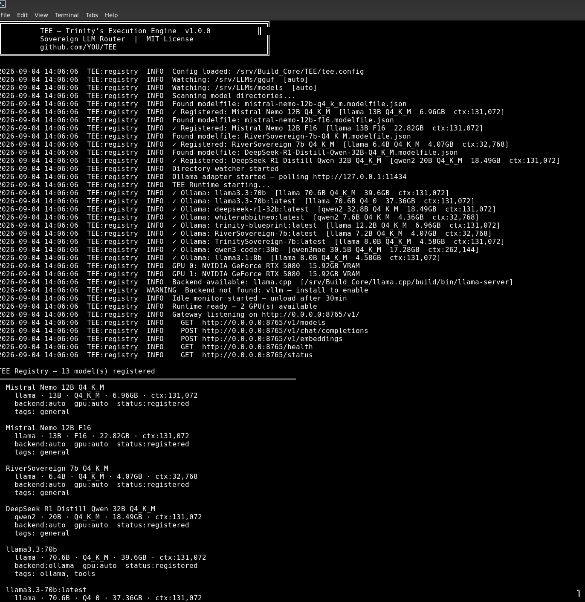
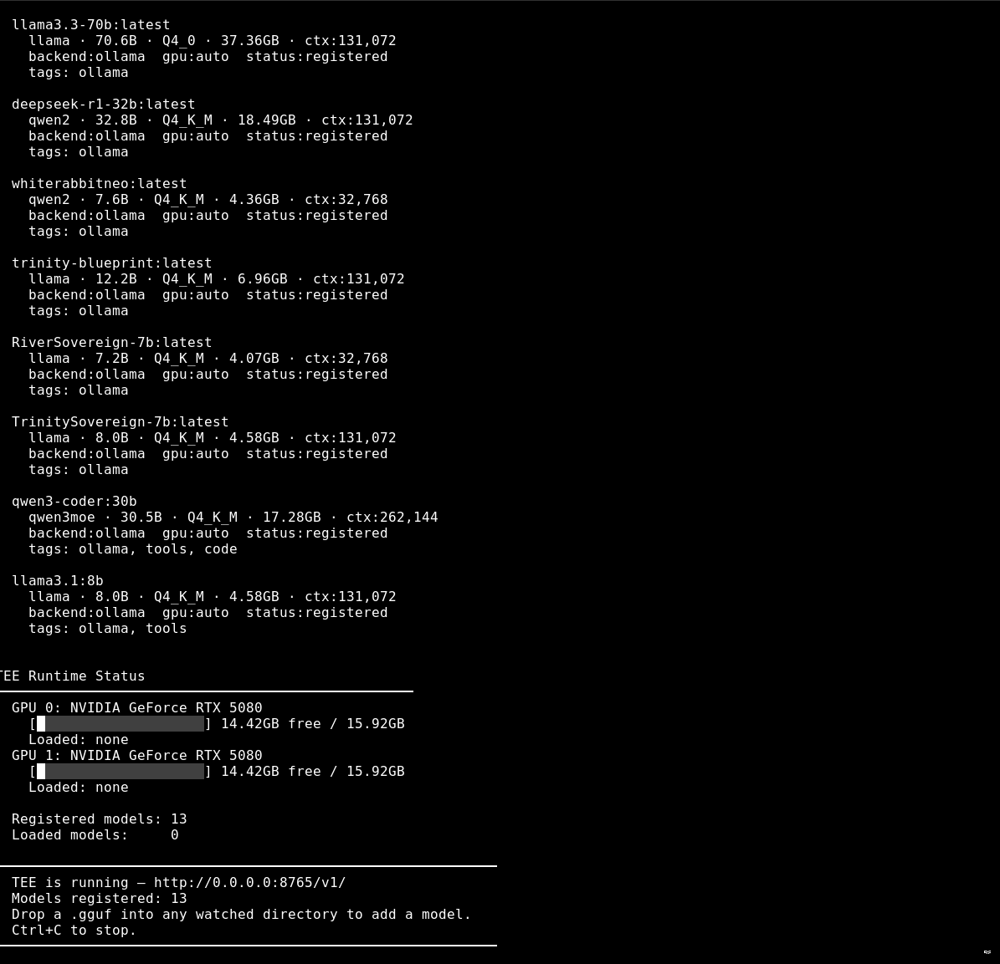
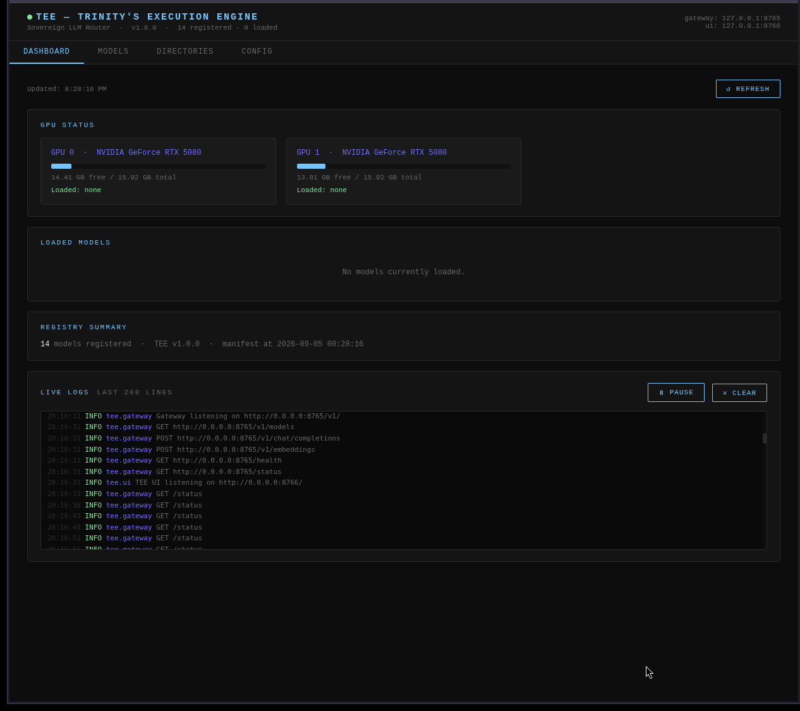

# TEE — Trinity's Execution Engine

> *You don't need them. You never did.*

TEE is a sovereign, open source LLM router. It sits between your applications and your local models — handling backend selection, GPU placement, model registration, and inference routing so nothing else has to.

No cloud. No accounts. No API keys to anyone else's kingdom. Your weights. Your hardware. Your rules.

---

## CLI




## UI — Sovereign Dashboard





---

## Why TEE exists

Every platform you build on will eventually change, restrict, monetize, or disappear.

- Ollama walled models behind access controls
- HuggingFace is being acquired
- Every "free" inference API has a ceiling

TEE is the exit ramp. Once it's running, none of that touches you.

---

## What TEE does

TEE does **one thing** — and does it completely:

Your App ──▶ TEE ──▶ llama.cpp / vLLM / Ollama ──▶ Your GPU ──▶ Your Model


- Receives inference requests via OpenAI-compatible API
- Knows which model to use
- Knows which backend to use
- Knows which GPU to use
- Returns the response

Everything else calls TEE. TEE calls nothing external.

---

## What TEE does NOT do

- No database
- No auth layer
- No cloud sync
- No telemetry
- No opinions about what calls it

---

## Quick Start

```bash
# Clone
git clone https://github.com/Trinity963/TEE.git
cd TEE

# Configure
cp tee.config.example tee.config
# Edit tee.config — set your models_dirs path

# Run
python3 tee.py
```

TEE starts, scans your model directories, registers everything it finds, and begins serving on `http://localhost:8765/v1/`

---

## Sovereign UI

TEE ships with a built-in browser dashboard. No dependencies. No CDN. Pure Python + vanilla JS.

```bash
python3 ui/server.py
```

Opens on `http://localhost:8766/`

**Dashboard** — real VRAM bars (live nvidia-smi), loaded models, registry summary, live log stream panel, auto-refresh every 5s  
**Models** — full registry table, load/unload buttons per model, HuggingFace download panel with live progress bars  
**Directories** — all watched model directories  
**Config** — visual view of tee.config, API Keys panel — save OpenRouter key from the UI, never hardcoded

---

## Plug and Play

Drop a GGUF into your models directory. TEE does the rest.

/models/mistral-7b-instruct-q4_k_m.gguf ← drop it here

TEE detects it
TEE reads the GGUF header
TEE generates the modelfile automatically
TEE registers the model
Model is live on /v1/ ← ready


No commands. No configuration. No technical knowledge required.

---

## Ollama Adapter

TEE auto-discovers all models served by a local Ollama instance. GGUF and Ollama models appear unified in the same registry and API.

- Polls `localhost:11434` on startup and every 30 seconds
- Skips cloud/remote stubs automatically
- Infers tags from model name and capabilities (`tools`, `code`, `thinking`, `vision`)
- Removes models that disappear from Ollama
- Routes requests for Ollama models back through `localhost:11434`

No configuration needed. If Ollama is running, TEE finds it.

---

## OpenAI-compatible API

Any application that speaks the OpenAI API protocol works with TEE immediately — zero changes required.

````bash
# List models
curl http://localhost:8765/v1/models

# Chat
curl http://localhost:8765/v1/chat/completions \
  -H "Content-Type: application/json" \
  -d '{"model": "mistral-7b-instruct", "messages": [{"role": "user", "content": "Hello"}]}'

# Load a model
curl -X POST http://localhost:8765/v1/models/load \
  -H "Content-Type: application/json" \
  -d '{"model": "mistral-7b-instruct"}'

# Unload a model
curl -X POST http://localhost:8765/v1/models/unload \
  -H "Content-Type: application/json" \
  -d '{"model": "mistral-7b-instruct"}'

# Download from HuggingFace
curl -X POST http://localhost:8765/v1/models/download \
  -H "Content-Type: application/json" \
  -d '{"repo_id": "bartowski/Mistral-7B-v0.3-GGUF", "filename": "Mistral-7B-v0.3.Q4_K_M.gguf"}'

# List active downloads
curl http://localhost:8765/v1/models/downloads
```
---

## Multi-Directory Model Support

TEE watches multiple model directories simultaneously. Models can live anywhere — NVMe, HDD, external drive, NAS. TEE sees all of it.

```json
"models_dirs": [
  { "path": "/mnt/nvme/models",    "label": "Fast Drive"     },
  { "path": "/mnt/hdd/models",     "label": "Large Storage"  },
  { "path": "/mnt/external/models","label": "External Drive" }
]
```

---

## Hardware Intelligence

TEE reads your system on startup and never lets you load a model your hardware cannot run.

Your System:
GPU 0: RTX 5080 16GB
GPU 1: RTX 5080 16GB
Total VRAM: 32GB

mistral-7b-instruct Q4_K_M (4.1GB) ✅ Single GPU
llama3-70b Q4_K_M (38GB) ✅ Multi-GPU — spans GPU 0+1
llama3-70b F16 (140GB) 🚫 Exceeds total VRAM


---

## Supported Backends

| Backend    | Format       | Status       |
|------------|--------------|--------------|
| llama.cpp  | GGUF         | ✅ Supported |
| Ollama     | GGUF         | ✅ Supported |
| vLLM       | Safetensors  | ✅ Supported |
| koboldcpp  | GGUF         | 🔜 Planned   |
| llamafile  | Llamafile    | 🔜 Planned   |

---

## Directory Structure

TEE/
├── tee.py # Entry point
├── tee.config # Live config
├── tee.config.example # Schema reference
├── core/
│ ├── registry.py # Model registry — reads manifests, watches dirs
│ ├── runtime.py # Load/unload, GPU placement, backend selection
│ ├── gateway.py # OpenAI-compatible API gateway
│ └── detector.py # GGUF header reader, modelfile auto-generator
├── adapters/
│ └── ollama.py # Ollama adapter — auto-discovers local models
├── ui/
│ └── server.py # Sovereign browser UI — port 8766
├── model-index/
│ └── ratings.json # Community model index
├── gpu-profiles/
│ └── profiles.json # GPU VRAM database
├── drive-profiles/
│ └── profiles.json # Drive type detection
├── config/
│ └── modelfile.example.json
└── docs/ # Screenshots and documentation


---

## VIVARIUM Integration

TEE is the inference backbone of the [VIVARIUM](https://github.com/Trinity963/VIVARIUM) sovereign AI ecosystem.

MiniTrini ──┐
Ethica ──┼──▶ TEE ──▶ llama.cpp / vLLM / Ollama ──▶ GPU
TBS ──┤
SARA ──┘


Any VIVARIUM project pointing at Ollama or an external API can point at TEE instead. Zero other changes required.

---

## Contributing

TEE is open source. Everything is open. Everything stays open.

**What the community maintains:**

- `model-index/ratings.json` — new models, updated ratings, download sources
- `gpu-profiles/profiles.json` — new GPU VRAM profiles
- `drive-profiles/profiles.json` — new drive type detection
- `adapters/` — new backend bridges
- `docs/` — translations, plain English improvements

**To contribute:**

1. Fork the repo
2. Make your change
3. Submit a PR with a clear description

No CLAs. No corporate overhead. Just useful changes that help people run their own AI.

---

## License

MIT — do whatever you want with it.

Just don't close it.  
Just don't wall it.  
Just don't charge for what was free.

---

## Built by

V — The Architect  
VIVARIUM Sovereign AI Ecosystem  
Toronto, Canada

*"Build it sovereign. Keep it sovereign. Share it sovereign."*
